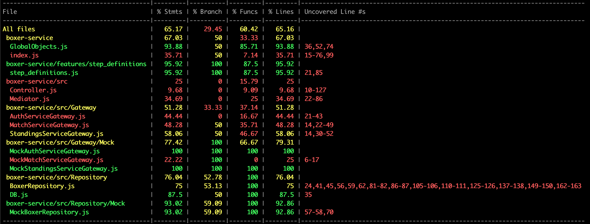

# Docs

## Coverage

### Coverage before refactoring

| File                                    | % Stmts | % Branch | % Funcs | % Lines | Uncovered Line #s                                                             |
| --------------------------------------- | ------- | -------- | ------- | ------- | ----------------------------------------------------------------------------- |
| All files                               | 65.17   | 29.45    | 60.42   | 65.16   |                                                                               |
| boxer-service                           | 67.03   | 50       | 33.33   | 67.03   |                                                                               |
| GlobalObjects.js                        | 93.88   | 50       | 85.71   | 93.88   | 36,52,74                                                                      |
| index.js                                | 35.71   | 50       | 7.14    | 35.71   | 15-76,99                                                                      |
| boxer-service/features/step_definitions | 95.92   | 100      | 87.5    | 95.92   |                                                                               |
| step_definitions.js                     | 95.92   | 100      | 87.5    | 95.92   | 21,85                                                                         |
| boxer-service/src                       | 25      | 0        | 15.79   | 25      |                                                                               |
| Controller.js                           | 9.68    | 0        | 9.09    | 9.68    | 10-127                                                                        |
| Mediator.js                             | 34.69   | 0        | 25      | 34.69   | 22-86                                                                         |
| boxer-service/src/Gateway               | 51.28   | 33.33    | 37.14   | 51.28   |                                                                               |
| AuthServiceGateway.js                   | 44.44   | 0        | 16.67   | 44.44   | 21-43                                                                         |
| MatchServiceGateway.js                  | 48.28   | 50       | 35.71   | 48.28   | 14,22-49                                                                      |
| StandingsServiceGateway.js              | 58.06   | 50       | 46.67   | 58.06   | 14,30-52                                                                      |
| boxer-service/src/Gateway/Mock          | 77.42   | 100      | 66.67   | 79.31   |                                                                               |
| MockAuthServiceGateway.js               | 100     | 100      | 100     | 100     |                                                                               |
| MockMatchServiceGateway.js              | 22.22   | 100      | 0       | 25      | 6-17                                                                          |
| MockStandingsServiceGateway.js          | 100     | 100      | 100     | 100     |                                                                               |
| boxer-service/src/Repository            | 76.04   | 52.78    | 100     | 76.04   |                                                                               |
| BoxerRepository.js                      | 75      | 53.13    | 100     | 75      | 24,41,45,56,59,62,81-82,86-87,105-106,110-111,125-126,137-138,149-150,162-163 |
| DB.js                                   | 87.5    | 50       | 100     | 87.5    | 35                                                                            |
| boxer-service/src/Repository/Mock       | 93.02   | 59.09    | 100     | 92.86   |                                                                               |
| MockBoxerRepository.js                  | 93.02   | 59.09    | 100     | 92.86   | 57-58,70                                                                      |
